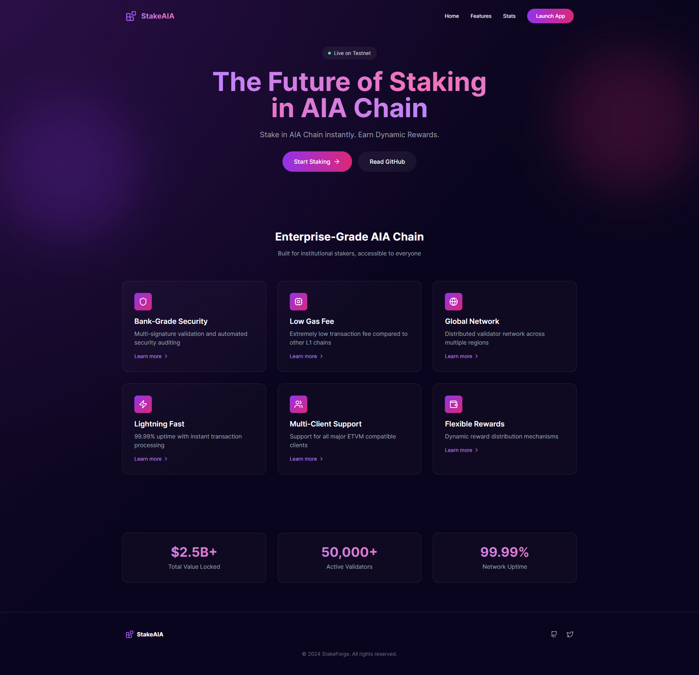

# StakeAIA 🌐

> **Decentralized Staking Platform on the AIA Blockchain**

StakeAIA is an open-source, decentralized application built on the AIA blockchain, allowing users to securely stake tokens, earn rewards, and contribute to the authenticity and value of the blockchain ecosystem.

---

## 📌 Project Overview
StakeAIA offers a seamless staking experience where users can lock tokens on the AIA blockchain, contributing to network stability and earning staking rewards in return. The application leverages smart contracts to enable transparent and secure reward distribution, creating real financial value for users and the blockchain.

[**Live Application**](https://aiastake.vercel.app/) | [**Staking Contract**](https://testnet.aiascan.com/address/0x80D419f04358365DCeeD0B83Dd1A3744CcF74dF1?tab=contract) | [**Reward Token**](https://testnet.aiascan.com/token/0xdAEFc38a5F4Eb642016225F747F5b36aB3f2a4e0?tab=contract) | [**Stake Token**](https://testnet.aiascan.com/token/0x84B8BBED63F2896B485c56137)

---

## 🛠️ Key Features

- **Token Staking**: Lock tokens into the platform, adding security and stability to the AIA blockchain.
- **Reward Distribution**: Earn consistent rewards based on staked tokens and duration.
- **Authenticity & Trust**: Utilize smart contracts to maintain transparency and user trust.
- **Open Source**: Contribute to the code and suggest improvements.

---

## 📒 Project Structure

- **Frontend**: Built using **React.js**, **Vite**, and **TailwindCSS** for a responsive, modern UI.
- **Smart Contracts**: Written in **Solidity** and deployed on the AIA testnet.

---

## 🚀 Getting Started

### Prerequisites
- **Node.js** (v14 or above)
- **npm** or **yarn**
- **Vite** for fast frontend setup

---

## 🔗 Contract Details
- **Staking Contract**: [0x80D419f04358365DCeeD0B83Dd1A3744CcF74dF1](https://testnet.aiascan.com/address/0x80D419f04358365DCeeD0B83Dd1A3744CcF74dF1?tab=contract)
- **Reward Token**: [0xdAEFc38a5F4Eb642016225F747F5b36aB3f2a4e0](https://testnet.aiascan.com/token/0xdAEFc38a5F4Eb642016225F747F5b36aB3f2a4e0?tab=contract)
- **Stake Token**: [0x84B8BBED63F2896B485c56137](https://testnet.aiascan.com/token/0x84B8BBED63F2896B485c56137)

---

## 🤝 Contributing
StakeAIA is an open-source project, and we welcome contributions from the community. Here’s how you can contribute:

1. **Fork the repository**.
2. **Create a new branch**:
3. **Make your changes**.
4. **Commit your changes**: `git commit -m 'Add your feature'`.
5. **Push to the branch**: `git push origin feature/YourFeature`.
6. **Open a Pull Request**.
---

## 📄 License
This project is licensed under the MIT License. 
---

**Made with 💙 on the AIA Blockchain**
